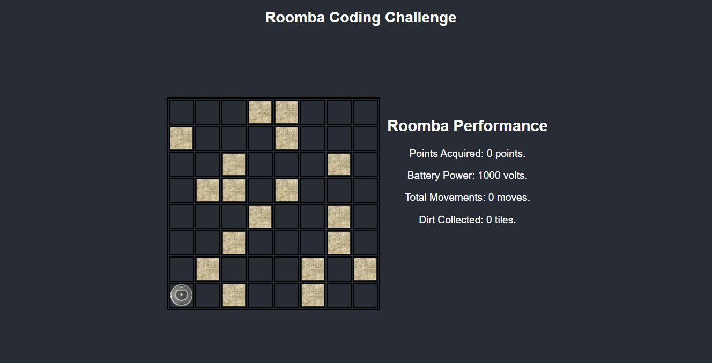

# Roomba Coding Challenge!

A cleaning Roomba simulation machine that searches for 18 random dirty tiles and clean them, on a 8 x 8 grid floor.

## Potential Fixes

- I logged the images on the tiles using css classes. So the roomba images glitches a bit when on a spot of a cleaned tile.
- Roomba still struggles a bit with going back to the point of origin. There is a lot of fixes and improvements needed.

## Screenshots

Full Screen: 

## Environment Setup

1. You'll need to clone https://github.com/Shembles/roomba-coding-challenge.git and run

```
npm install
```

then

```
npm start
```

2. Open up a window at localhost:3000

## Built With

### Front-End

- [React](https://reactjs.org/)
